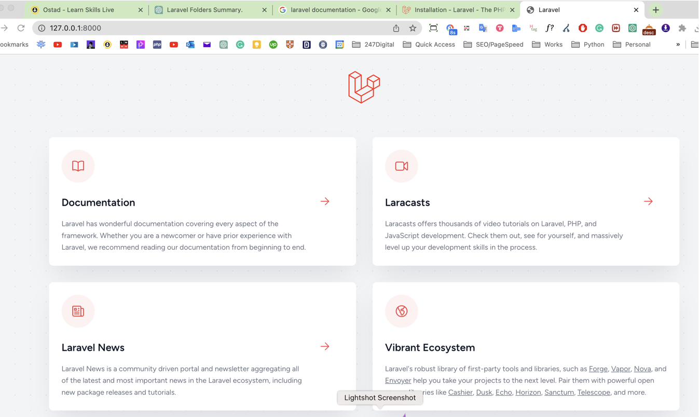
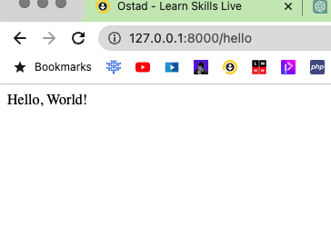

# Laravel Installation and Folder Structure Assignment
    This is the answer paper to the assiment.

## Part 1: Laravel Installation

    Install the latest version of Laravel using either Composer or the Laravel installer. Document the steps you took to install Laravel.

### Installation Documentation:

1. Install Composer on your Mac Using  ` $brew install composer`
2. Type the following command to install laravel project ` composer creat-project laravel/laravel project-name `

Next Task: 

    Verify that Laravel is installed and working correctly by creating a new Laravel project and running the development server. Take a screenshot of the running server.

1. To reun the server we have to use the following command `php artisan serve`
2. Server URL: http://127.0.0.1:8000

## Part 2: Laravel Folder Structure

Here is a brief description of each of the folders in a typical Laravel project:

1. `app`: This folder contains the application's core logic, such as models, controllers, and services.

2. `bootstrap`: This folder contains the application's bootstrapping files, including the `app.php` file, which initializes the Laravel application.

3. `config`: This folder contains the application's configuration files, such as `app.php` and `database.php`.

4. `database`: This folder contains database-related files, such as database migrations and seeders.

5. `public`: This folder contains the application's public files, such as images, stylesheets, and JavaScript files. This is also the web server's document root directory, meaning that this is the directory from which the web server serves the application.

6. `resources`: This folder contains the application's raw resources, such as views, language files, and raw assets like LESS or SASS files.

7. `routes`: This folder contains the application's route definitions, which map incoming requests to controllers or closures.

8. `storage`: This folder contains the application's temporary and cached files, as well as uploaded files and other assets that are not intended to be publicly accessible.

9. `tests`: This folder contains the application's automated tests, written using Laravel's built-in testing framework.

10. `vendor`: This folder contains the third-party libraries that the application depends on, such as Laravel itself and any additional packages installed via Composer.

 

### Create a new route in your Laravel project that displays a simple "Hello, World!" message. Take a screenshot of the running route.

First we have to go to the `routes` folder and open the `web.php `file. Inside the `web.php` file, need to add the following code:
`
Route::get('/hello', function () {
    return 'Hello, World!';
});
`
the url will be: http://127.0.0.1:8000/hello

